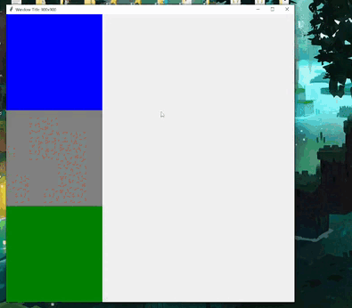

# ResponsiveTkinter - 1.0.1
## What is this
This is a simple library that allows you to create responsive widgets in your tkinter window. 

## What does "responsive" mean?
Responsive is a development approach that creates dynamic changes to the appearance of a widget, depending on the window size and orientation of the device being used to view it. ... In responsive design, window widgets reshuffle as the window size grows or shrinks.

## Install
`pip install ResponsiveTkinter`

## Examples

When the window has been resized it will modify the grid placement.
```python
from tkinter import Frame, Tk
from ResponsiveTkinter import Responsive

root=Tk()
root.title('Window Title')
root.geometry('900x900')
left = Frame(root,width=300,height=300,bg='blue')
left.grid(row=0,column=0)
main = Frame(root,width=300,height=300,bg='gray')
main.grid(row=1,column=0)
right = Frame(root,width=300,height=300,bg='green')
right.grid(row=2,column=0)

# Make widgets responsive
R = Responsive(root,901) # Windows width must be more than 900 for it to work.
R.grid(main,row=0,column=1) # Change pos in the grid
R.grid(right,row=0,column=2)
root.mainloop()
```



## License
MIT License